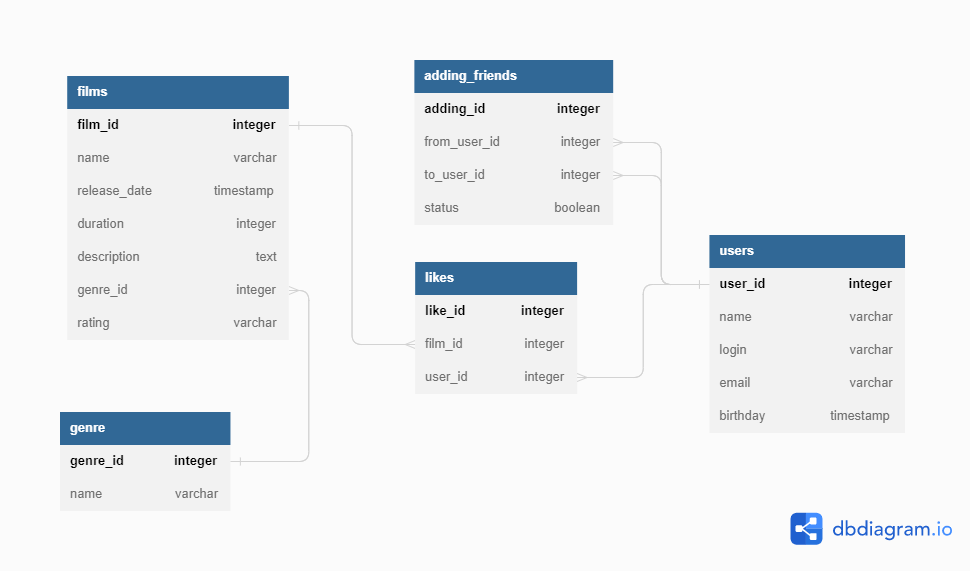

# java-filmorate

Template repository for Filmorate project.

# Схема базы данных



# В этой схеме используются следующие таблицы:

- films — таблица с информацией о фильмах, такой как название, год выпуска, жанр и рейтинг.
- users — таблица с информацией о пользователях, такой как имя, логин, email, дата рождения.
- genre — таблица с информацией о жанрах фильмов, такой как название.
- adding_friends — таблица с информацией о дружеских связях между пользователями, такой как идентификаторы пользователей
  и
  статус запроса на добавление в друзья.
- likes — таблица с информацией о лайках фильмов от пользователей, такой как идентификаторы фильма и пользователя.

# Между таблицами установлены следующие связи:

- Один фильм может иметь один жанр, а один жанр может иметь много фильмов. Это связь один-ко-многим (one-to-many) между
  таблицами films и genres по полю genre_id.
- Один фильм может иметь много лайков от разных пользователей, и один пользователь может ставить лайки разным фильмам.
  Это связь многие-ко-многим (many-to-many) между таблицами films и users через промежуточную таблицу likes по полям
  film_id и user_id.
- Один пользователь может иметь много друзей, и один друг может быть другом для многих пользователей.
  Это связь многие-ко-многим (many-to-many) между таблицей users и самой собой через промежуточную таблицу friendships
  по полям from_user_id и to_user_id.

# В этом разделе приведены примеры запросов к базе данных для основных операций приложения, таких как:

- Получение общих друзей между двумя пользователями:

```sql
  SELECT u.*
  FROM users u
  JOIN adding_friends f ON u.id = f.to_user_id
  WHERE f.from_user_id IN (1, 2) -- здесь 1 и 2 это идентификаторы пользователей, для которых мы ищем общих друзей
  GROUP BY u.id;
```

- Получение 10 самых популярных фильмов по количеству лайков:

```sql
  SELECT f.*, COUNT(l.id) AS likes_count
  FROM films f
  JOIN likes l ON f.id = l.film_id
  GROUP BY f.id
  ORDER BY likes_count DESC
  LIMIT 10;
```

- Получение всех фильмов:

```sql
  SELECT *
  FROM films;
```

- Получение всех пользователей:

```sql
  SELECT *
  FROM users;
```